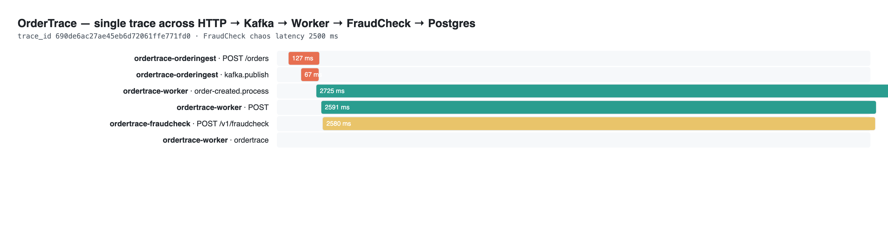
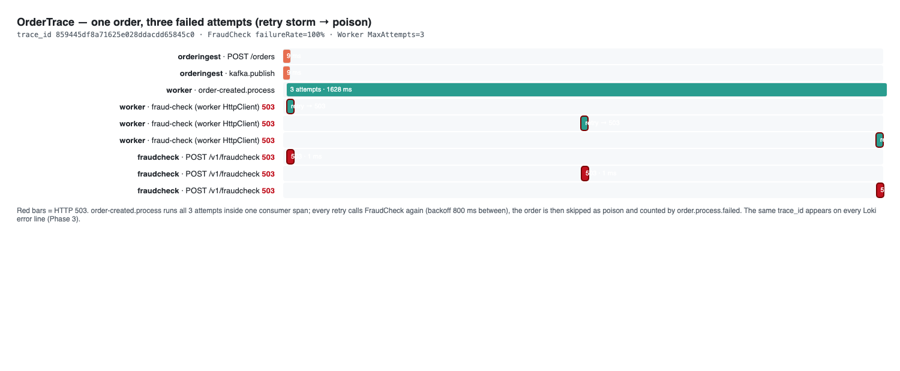

# OrderTrace — Event-Driven Observability Demo

[](https://dotnet.microsoft.com/)
[](https://kafka.apache.org/)
[](https://opentelemetry.io/)

A portfolio demo of **observability** in an event-driven system. An order travels
`HTTP → Kafka → Worker → (external fraud-check HTTP) → PostgreSQL`, and the question
this project answers is: *when that journey misbehaves, how do you find the root cause?*

> **Purpose:** GitHub portfolio project showcasing OpenTelemetry end-to-end tracing
> across async boundaries (Kafka header propagation), RED metrics, and log→trace
> correlation — visualized in a Grafana **LGTM** stack.

## Status

| Phase | Scope | State |
|---|---|---|
| **1** | Working log-only pipeline + chaos injection (the "blind" baseline) | ✅ implemented |
| **2** | OpenTelemetry distributed tracing + Kafka propagation | ✅ implemented |
| **3** | RED metrics + structured logs with trace correlation | ✅ implemented |

The project follows the portfolio formula: Phase 1 ships a *working* system that is
painful to debug; a later phase instruments it and proves the same failure is found
in seconds. Git history (issue → branch → PR → merge commit) tells that story.

The full architecture, message/persistence contracts and the observability contract
(three signals, exact instrument and log-field names) are specified in
[`docs/project-domain-spec.md`](docs/project-domain-spec.md).

## Architecture

```
   POST /orders                      order-created (Kafka)
 ┌──────────────┐  publish   ┌────────────────────┐   consume   ┌────────────────────────┐
 │ OrderIngest  │───────────▶│     Kafka topic    │────────────▶│ OrderTrace.Worker     │
 │ (producer)   │            └────────────────────┘             │ (consumer)            │
 └──────────────┘                                              │    │ HTTP              │
                                                               │    ▼                   │
                                                               │  FraudCheck (flaky)   │
                                                               │    │ EF/Npgsql         │
                                                               │    ▼                   │
                                                               │  order_events (PG)    │
                                                               └────────────────────────┘
```

- **OrderIngest** — minimal API (`:5010`): `POST /orders` → publish `OrderCreated` → `202 Accepted`.
- **OrderTrace.Worker** — Kafka consumer: calls **FraudCheck**, persists a per-order
  `order_events` row to PostgreSQL, then commits its offset (at-least-once).
- **FraudCheck** (`:5011`) — mock external dependency. Under chaos it gets slow
  (`latencyMs`) or fails (`failureRate`); knobs change at runtime via `/_chaos`.

## Quick Start (Phase 1)

Prereqs: [.NET 10 SDK](https://dotnet.microsoft.com/download/dotnet/10.0), Docker Desktop.

```bash
# 1. Infra: Kafka + PostgreSQL (+ LGTM stack from Phase 2)
docker compose -f infra/docker-compose.yml up -d

# 2. Services (three terminals)
dotnet run --project src/OrderTrace.FraudCheck        # :5011
dotnet run --project src/OrderTrace.Worker            # :5011 → worker consumes
dotnet run --project src/OrderTrace.OrderIngest       # :5010
```

> Worker applies its schema on startup (`EnsureCreated`), so no migrations step is needed.

### Smoke test

```bash
# Healthy order (fast path)
curl -s -X POST http://localhost:5010/orders -H 'Content-Type: application/json' \
  -d '{"customerName":"Ada","totalAmount":1250.50}'

# Chaos: make FraudCheck take ~2.5 s → order processing slows down
curl -s -X POST http://localhost:5011/_chaos -H 'Content-Type: application/json' \
  -d '{"latencyMs":2500,"failureRate":0}'

# Reset chaos
curl -s -X POST http://localhost:5011/_chaos -H 'Content-Type: application/json' \
  -d '{"latencyMs":0,"failureRate":0}'
```

Watch the three consoles: each service logs its slice of the story, but no single
log stream can tell you *where* the 2.5 s went — that is exactly the Phase 1 problem.

## Phase 2 — Seeing the same order as one trace

Phase 2 instruments the same flow with OpenTelemetry. Each service exports spans over
OTLP to the bundled **LGTM** stack (`infra/docker-compose.yml` already runs it), and the
W3C `traceparent` context is carried manually across Kafka message headers (Confluent.Kafka
has no auto-instrumentation — see `OrderTrace.Shared/Telemetry/Tracing.cs`). The same slow
order now shows as a single waterfall in Grafana/Tempo:

```
ordertrace-orderingest   POST /orders           127 ms   ← root (HTTP server)
 └ kafka.publish         (producer)                      ← traceparent injected on the record
    └ order-created.process           2 725 ms   ← worker resumes the trace from headers
       ├ POST /v1/fraudcheck          2 580 ms   ← joined over HTTP (worker → FraudCheck)
       └ ordertrace (EF Core → PG)       18 ms
```

The 2.6 s is now attributable in seconds: the consumer span is slow because its
fraud-check child span took 2.5 s. The same trace as a waterfall (Tempo/Grafana):



### Run it

Start the services with the OTLP exporter pointed at the LGTM stack:

```bash
# OrderIngest / Worker / FraudCheck (three terminals) — kafka/postgres/LGTM already up
OTEL_SERVICE_NAME=ordertrace-orderingest OTEL_EXPORTER_OTLP_ENDPOINT=http://localhost:4318 OTEL_EXPORTER_OTLP_PROTOCOL=http/protobuf \
  dotnet run --project src/OrderTrace.OrderIngest --launch-profile http     # :5010

OTEL_SERVICE_NAME=ordertrace-worker OTEL_EXPORTER_OTLP_ENDPOINT=http://localhost:4318 OTEL_EXPORTER_OTLP_PROTOCOL=http/protobuf \
  dotnet run --project src/OrderTrace.Worker

OTEL_SERVICE_NAME=ordertrace-fraudcheck OTEL_EXPORTER_OTLP_ENDPOINT=http://localhost:4318 OTEL_EXPORTER_OTLP_PROTOCOL=http/protobuf \
  dotnet run --project src/OrderTrace.FraudCheck --launch-profile http     # :5011
```

Then post an order while FraudCheck is slow, open **http://localhost:3000** (admin/admin),
Explore → **Tempo**, and search by Trace ID:

```bash
curl -s -X POST http://localhost:5011/_chaos -H 'Content-Type: application/json' \
  -d '{"latencyMs":2500,"failureRate":0}'                      # make FraudCheck slow
curl -s -X POST http://localhost:5010/orders -H 'Content-Type: application/json' \
  -d '{"customerName":"Ada","totalAmount":1250.50}'            # order whose trace you want
curl -s -X POST http://localhost:5011/_chaos -H 'Content-Type: application/json' \
  -d '{"latencyMs":0,"failureRate":0}'                         # reset chaos
```

Each service also logs its `TraceId`, so a single id can be matched across the OrderIngest,
Worker and FraudCheck consoles — proof the trace survived the async hop even before opening
Grafana.

## Phase 3 — Metrics, and logs you can jump to the trace from

Phase 3 answers the two gaps Phase 1 could not close: *how long did the worker really spend
on an order (retries included)?* and *given a log line, where is its full trace?*

Two additions (same OTLP export, three signals now):

1. **RED metrics** — ASP.NET Core / HttpClient instrumentations feed `http.server.request.duration`
   and `http.client.request.duration` per service. The Worker's consumer path has no inbound HTTP,
   so it gets **business RED instruments** (`OrderTrace.Shared/Telemetry/OrderMetrics.cs`):
   `order.process.duration` (histogram, tagged `outcome` + `attempts`) plus
   `order.process.completed` / `order.process.failed` counters.
2. **Structured logs with trace context** — logs export over OTLP (`WithLogging`), so every
   Loki record carries `trace_id` / `span_id`. Any log line → *click the trace id* → Tempo waterfall.

### The Phase 1 problem, closed with metrics + logs

Make FraudCheck *fail*, not slow, and send two orders: the worker retries each 3 times
(`MaxAttempts=3`, 800 ms backoff), gives up, and skips them as poison. This is the retry storm
that Phase 1 logs made visible only as a wall of text:



That one trace says everything: a single `order-created.process` span containing three 503
fraud-check calls — each retry is a **span**, not a guess. The same order's Loki error lines
all carry `trace_id 859445df…`, so you can start from any `FraudCheck FAILED` log and land on
this waterfall.

### Metrics after that run (Prometheus)

```promql
order_process_completed_total                                    # = 2  (healthy orders)
order_process_failed_total                                       # = 2  (poisoned orders)
sum by (outcome, attempts) (order_process_duration_milliseconds_count)
#   {attempts="1", outcome="ok"}     = 2     ← fast path, ~100 ms each
#   {attempts="3", outcome="failed"} = 2     ← retry storm, ~1.6 s each (3 attempts, 800 ms backoff)
sum by (outcome) (order_process_duration_milliseconds_sum)
#   {outcome="ok"} = 209   {outcome="failed"} = 3234   (ms)
```

And on the FraudCheck side, the HTTP RED error rate for the same window is unambiguous:

```promql
sum by (http_response_status_code)
  (http_server_request_duration_seconds_count{http_route="/v1/fraudcheck"})
#   {http_response_status_code="200"} = 1     ← recovered /_chaos probe
#   {http_response_status_code="503"} = 6     ← 2 orders × 3 attempts
```

The story Phase 1 could not tell is now three minutes of clicking: an **error spike** on the
RED dashboard → a **poisoned-order histogram** showing `attempts=3` → one **trace** with the
three 503s → **Loki logs** sharing that `trace_id`. Every leg confirms the same root cause:
FraudCheck was returning 503 and the worker kept retrying until it gave up.

### Run it

Same three terminals as Phase 2 (OTLP env vars in that section). Open **http://localhost:3000**
(admin/admin): *Explore → Prometheus* for `order.process.*` / `http.server.request.duration`,
*Explore → Loki* for any service's logs (fields include `trace_id`, `span_id`, `OrderId`), and
*Explore → Tempo* to search a `trace_id` copied from a log line.

```bash
# Failure-injection spell: 2 orders become poison (3 failed attempts each)
curl -s -X POST http://localhost:5011/_chaos -H 'Content-Type: application/json' \
  -d '{"latencyMs":0,"failureRate":1}'
curl -s -X POST http://localhost:5010/orders -H 'Content-Type: application/json' \
  -d '{"customerName":"Retry-A","totalAmount":200.0}'
curl -s -X POST http://localhost:5010/orders -H 'Content-Type: application/json' \
  -d '{"customerName":"Retry-B","totalAmount":300.0}'
# wait ~20 s for the retries to exhaust, then recover
curl -s -X POST http://localhost:5011/_chaos -H 'Content-Type: application/json' \
  -d '{"latencyMs":0,"failureRate":0}'
curl -s -X POST http://localhost:5010/orders -H 'Content-Type: application/json' \
  -d '{"customerName":"Healthy-C","totalAmount":150.0}'
```

## Repo Layout

```
├── src/
│   ├── OrderTrace.Shared/       # events, topic constants, W3C Tracing inject/extract, OrderMetrics
│   ├── OrderTrace.OrderIngest/  # Kafka producer (API) + OTel (tracing · metrics · logs)
│   ├── OrderTrace.Worker/       # consumer + fraud-check + Postgres + OTel (all three signals)
│   └── OrderTrace.FraudCheck/   # flaky downstream + runtime chaos + OTel (all three signals)
├── tests/
│   └── OrderTrace.Tests/        # Kafka traceparent round-trip (Testcontainers) + OrderMetrics unit test
├── infra/docker-compose.yml     # kafka + postgres + grafana/otel-lgtm
├── CLAUDE.md                    # git + code conventions
└── docs/
    ├── project-domain-spec.md   # committed project & domain specification
    └── screenshots/             # trace/waterfall evidence embedded above
```

## License

MIT — Built for portfolio demonstration purposes.
